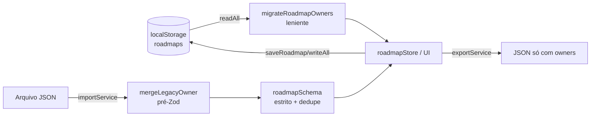
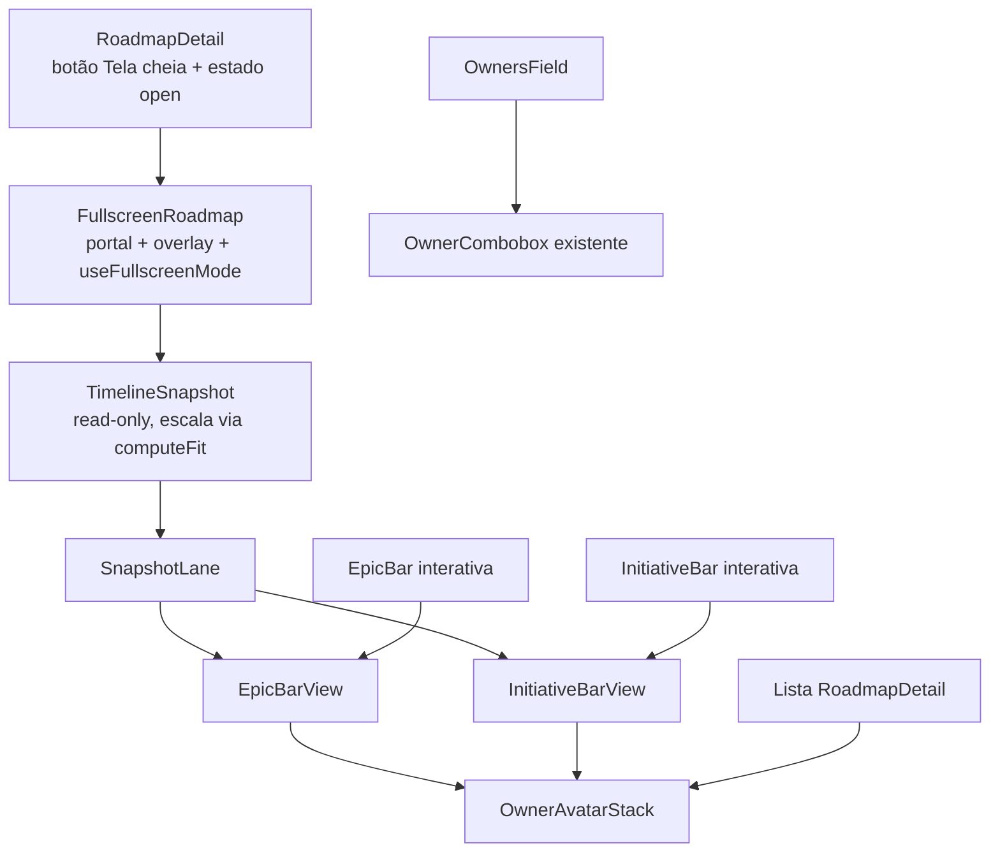

# Design: múltiplos responsáveis (épico/iniciativa) e modo tela cheia

- **Autor:** Arquiteto | **Fluxo:** 2 (Evolução) | **Etapa:** arquitetura | **Prioridade:** P2
- **Entrada:** `docs/specs/owners-e-fullscreen.md` (Product Analyst) + código real em `src/`
- **ADRs:** [ADR-0001](../adr/ADR-0001-modelo-de-dados-owners.md) (modelo), [ADR-0002](../adr/ADR-0002-runner-de-testes-vitest.md) (testes), [ADR-0003](../adr/ADR-0003-estrategia-de-tela-cheia.md) (tela cheia)
- **Status:** proposta, pronta para o Dev Frontend (gates do Manager em "Decisões pendentes", nenhum bloqueia o início)

## 0. Contexto e restrições

App 100% client-side (React 19, Zustand, Zod 4, dnd-kit, Vite 8, TS 6), publicado no GitHub Pages **a cada push em `main`** (`deploy.yml`: lint, `tsc -b`, build). Dados vivem no `localStorage` do usuário e em JSONs exportados que circulam entre pessoas. Não há runner de testes, telemetria, back-end nem versionamento de schema.

**Requisitos não funcionais que governam o desenho**

| RNF | Meta |
| --- | --- |
| Não perder dado | 100% dos roadmaps existentes (localStorage e JSON antigo) mantêm seus responsáveis |
| Reversibilidade | Rollback de código nunca destrói dado; migração na leitura, backup antes da primeira gravação migrada |
| Não regressão | Timeline interativa (drag, resize, rolagem) permanece exatamente como hoje |
| Fullscreen | Sem rolagem em nenhum eixo, em 320px a ultrawide, recalcula em resize/rotação |
| Custo | Zero dependência de runtime nova; 1 conjunto de devDependencies de teste (ADR-0002) |
| A11y | Nome acessível dos avatares/"+N", foco gerenciado, Esc e botão equivalentes |

## 1. Modelo `owner` → `owners` e migração

### 1.1 Opções consideradas

| Opção | Prós | Contras | Esforço |
| --- | --- | --- | --- |
| A. Renomear para `owners?: string[]` e migrar na leitura (escolhida) | Igual a `Objective`; um só caminho de código; sem campo morto | Rollback de código perde a *exibição* dos responsáveis novos (dado preservado) | M |
| B. Manter `owner` e adicionar `owners` (dois campos vivos) | Rollback trivial | Dois campos para sempre, regra de precedência em todo consumidor, export confuso (contraria Q-O5) | M |
| C. Dual-write (`owners` + `owner = owners[0]`) por uma release | Rollback exibe o 1º responsável | Polui o JSON exportado, o export "novo" voltaria a ter `owner` (contraria O11); complexidade para ganho pequeno | M+ |
| D. Migrar para IDs de membro | Resolve rename/remoção | Fora de escopo (spec §3), exige mudar `OwnerCombobox`/`teamMemberStore` | G |

**Escolha: A + backup de segurança** (ver 1.5). Detalhes em ADR-0001.

### 1.2 Tipo e schema

- `types/roadmap.types.ts`: `Epic.owner` e `Initiative.owner` viram `owners?: string[]`. `Objective.owners` **não muda**.
- `schemas/roadmap.schema.ts`: criar `ownersSchema` e usá-lo **só** em `initiativeBaseSchema` e `epicBaseSchema` (o de `objectiveBaseSchema` fica como está, para não alterar o contrato do objetivo).

```ts
// contrato (não é código final)
const ownersSchema = z
  .array(z.string().trim().min(1))          // [""] / [123] / "Ana" => erro com o caminho atual
  .transform(dedupeCaseInsensitive)         // mantém a 1ª grafia e a ordem
  .transform(list => (list.length ? list : undefined))
  .optional();
```

Validar no PR que o `.trim()`/`.transform` do Zod 4 mantém `z.infer` coerente com `Epic`/`Initiative` e que `withDateOrder` (que recebe `z.ZodType<T>`) continua tipando; se a inferência quebrar, mover a normalização para a etapa pós-`safeParse` (equivalente, só muda o lugar).

### 1.3 Helpers puros (novo `src/utils/owners.ts`)

Funções puras, sem I/O, são o núcleo testável da migração.

| Função | Contrato |
| --- | --- |
| `dedupeOwners(list: string[]): string[]` | trim, remove vazios, dedupe case-insensitive (`toLowerCase`, como `ObjectiveForm.addOwner` e `findMemberPhoto`), mantém 1ª grafia e ordem |
| `mergeLegacyOwner(item): item` | `owners' = dedupe([owner (se string não vazia), ...owners (se array)])`; remove a chave `owner`; `[]` vira `undefined`; **não valida tipos** (se `owners` não é array, deixa como está para o Zod acusar) |
| `migrateRoadmapOwners(raw: unknown): Roadmap` | percorre `objectives[].epics[].initiatives[]` aplicando `mergeLegacyOwner`; tolerante a formato inesperado; **idempotente**; não toca `updatedAt`; não muta a entrada |
| `ownersTooltipLine(owners)` | `""` / `Responsável: X` (1) / `Responsáveis: A, B` (2+) |

### 1.4 Pontos de contato



| Ponto | Mudança |
| --- | --- |
| **Leitura do localStorage** (`storageService.readAll`) | Depois do `JSON.parse`, `parsed.map(migrateRoadmapOwners)`. Atalho de performance: só percorre se `raw.includes('"owner"')` (não casa com `"owners"`). Entradas não-string/vazias em `owners` são descartadas e contadas (1 `console.warn` por carga, sem nomes: LGPD). Em memória, nunca grava aqui. |
| **Backup** (mesmo `readAll`) | Se a migração encontrou `owner` legado e a chave `roadmap-builder:roadmaps:pre-owners-backup` não existe, grava nela o `raw` original (try/catch por cota; falha não impede o app). Nunca sobrescreve (preserva o legado mais antigo). |
| **Gravação** | `saveRoadmap`/`writeAll` já gravam o array inteiro lido por `readAll`. Consequência real: **a 1ª gravação de qualquer roadmap migra todos** (a spec dizia "no próximo save do item"; na prática é do array inteiro; o backup cobre isso). |
| **Import** (`importService`) | Antes do `roadmapSchema.safeParse`, aplicar `mergeLegacyOwner` em cada item (arquivo antigo, novo ou misto: O10, O11, O12). O Zod estrito rejeita lixo (O13) com a mensagem/caminho atuais. Um `owner` legado de tipo errado é movido para `owners` como veio, para o Zod acusá-lo (nunca descartar em silêncio, o Zod remove chaves desconhecidas). |
| **Export** (`exportService`) | Sem código novo: serializa o objeto em memória (já migrado), então sai `owners` e não `owner` (O11). Teste cobre. |
| **Seed** (`utils/seedData.ts`) | Trocar `owner: 'X'` por `owners: [...]`; ao menos 1 épico e 1 iniciativa com 2+ (e 1 com nome fora do time). Seed só roda em instalação nova; usuários existentes dependem da migração. |
| **Store** | `EpicInput`/`InitiativeInput`: `owner?` vira `owners?: string[]`. `{...e, ...patch}` já preserva `owners` em updates de datas (O21). |
| **Clone/duplicar** | `cloneRoadmap` espalha o objeto; `owners` (array) é copiado por referência, aceitável porque o estado é imutável. Teste confirma que editar a cópia não altera o original (O20). |

### 1.5 Plano de rollback do modelo

| Cenário | Efeito | Ação |
| --- | --- | --- |
| Rollback do código **antes** de qualquer gravação na versão nova | Nenhum: a leitura não grava. Só existe a chave de backup (inofensiva) | `git revert` + deploy |
| Rollback **depois** de gravações | `localStorage` tem `owners` e não `owner`. A versão antiga ignora `owners` (não exibe responsáveis de épico/iniciativa) mas **não apaga** (os updates fazem spread). **Dado intacto.** Se o usuário editar um épico no código antigo, grava `owner` e, ao voltar para frente, o merge combina os dois | Preferir **roll-forward** (correção). Se for preciso voltar, 2 saídas: (a) restaurar `roadmap-builder:roadmaps` a partir da chave de backup (perde edições posteriores); (b) snippet de console que reidrata `owner = owners[0]` (documentar no runbook do PR) |
| JSON novo importado numa versão antiga | O Zod antigo descarta `owners` de épico/iniciativa em silêncio | Risco aceito e documentado (só ocorre após rollback); orientar a usar o export de antes |
| Aba antiga aberta durante o deploy | Aba velha grava `owner`; a próxima leitura nova migra | Coberto pela migração leniente em toda leitura |
| Corrupção por bug da migração | Backup preserva o original | Runbook: restaurar a chave de backup |

Limpeza: remover a chave de backup e o ramo `owner` da leitura numa release futura (≥ 2 releases ou após decisão do Manager). Registrar como dívida.

## 2. Tela cheia

### 2.1 Fullscreen API vs overlay CSS

| Opção | Prós | Contras |
| --- | --- | --- |
| Só Fullscreen API | "Tela cheia" de verdade, sem chrome do navegador | Indisponível no iPhone/iPad (elementos não-vídeo), pode ser negada, Esc nativo não chega ao app |
| Só overlay CSS (`position: fixed; inset: 0`) | Funciona em todo lugar, controle total do Esc | Barra de endereço continua visível; não é "tela cheia" no desktop |
| **Overlay CSS como base + Fullscreen API como melhoria progressiva (escolhida)** | Um único caminho de render; fallback automático (F8); ganha tela inteira onde existir | Duas fontes de "estado" a sincronizar (F7) |

Decisão detalhada em ADR-0003. Contrato do hook `useFullscreenMode` (`src/components/roadmap/fullscreen/`):

1. `enter()` roda **no handler de clique** (gesto do usuário): chama `document.documentElement.requestFullscreen({ navigationUI: 'hide' })` (ou `webkitRequestFullscreen`), com `try/catch` e `.catch(noop)`, e **sempre** abre o overlay (`open = true`). Alvo = `documentElement` (não o overlay) porque o overlay ainda não existe no momento do gesto, e assim modais/portais continuam visíveis.
2. `mode`: `'native'` se a promessa resolveu, `'overlay'` caso contrário. Exposto como `data-fullscreen-mode` no overlay (QA e suporte).
3. **Sincronização (F7):** `fullscreenchange` (e `webkitfullscreenchange`): se `open` e `mode === 'native'` e `document.fullscreenElement == null`, chama `close()`. Nunca fica "preso" em nenhum dos dois sentidos.
4. **Esc (F5, F18):** `keydown` no `document`: `Escape` fecha, **exceto** se houver modal aberto (exportar `hasOpenModal()` de `Modal.tsx` lendo `modalStack.length`, sem mexer na lógica atual). Em fullscreen nativo o Chrome consome o Esc; quem sincroniza é o item 3.
5. `close()` é idempotente: sai do fullscreen nativo se ativo (`exitFullscreen().catch(noop)`), restaura foco no botão "Tela cheia" e remove efeitos.
6. **Foco e isolamento (F20):** overlay em `createPortal(document.body)` com `role="dialog" aria-modal="true" aria-label="Roadmap em tela cheia: <nome>"`; ao abrir, foco no botão "Sair"; `#root` recebe `inert` enquanto aberto (evita Tab para trás sem implementar focus trap manual; revertido no cleanup). Guardar `document.activeElement` ao abrir para restaurar.
7. Não persistir (F21): estado só em `useState`.
8. z-index do overlay acima da sidebar (60) e abaixo do `Modal` (100) é irrelevante na prática (modais ficam inacessíveis); usar 90.

### 2.2 Estratégia de "fit" (sem rolagem)

**Princípio:** a timeline interativa fica **intocada**. O modo cheia é um **componente de visualização separado e somente leitura** (`TimelineSnapshot`), porque `useDraggable`/`useDroppable` não podem ser desligados condicionalmente (regras de hooks), o snap do dnd-kit e o resize por `pointermove` assumem pixels sem escala (spec §0.7), e a rolagem/`MIN_DAY_WIDTH` são exatamente o que queremos evitar. Compartilha-se apenas apresentação (ver 2.5).

**Algoritmo (duas dimensões, escala uniforme):**

```
entradas: viewportW, viewportH (caixa de conteúdo do overlay, via ResizeObserver),
          naturalH (altura do snapshot em escala 1, medida: offsetHeight não é afetado por transform),
          totalDays (dias úteis do período), labelWidth0 (220, ou 150 se viewportW < 768)

scale        = clamp(viewportH / naturalH, MIN_SCALE = 0.05, 1)      // nunca amplia (F15)
logicalW     = viewportW / scale                                      // largura "virtual" antes de escalar
labelWidth   = min(labelWidth0, logicalW * 0.4)                       // janela minúscula
dayWidth     = (logicalW - labelWidth) / totalDays                    // SEM MIN_DAY_WIDTH (F2, F22)
render       = stage com width = logicalW, transform: scale(scale), transform-origin: top left
```

Por que funciona: a largura se resolve esticando o `dayWidth` no espaço lógico; a altura se resolve com a mesma escala, e `logicalW * scale == viewportW`. Resultado: preenche a largura, nunca passa de 100%, nunca rola.

Regras e cuidados:

- **Altura independe da largura** só se nada quebrar linha em função dela. Garantir: rótulo da raia com largura fixa (já), cabeçalho do snapshot em **uma linha** (`white-space: nowrap`, reticências), legenda com `flex-wrap: nowrap`/`overflow: hidden`. Sem isso há risco de oscilação (escala menor → largura lógica maior → menos quebras → altura menor → escala maior...). Defesa adicional: só aplicar nova escala se `|Δ| > 0.005`.
- **Medição** em `useLayoutEffect` + `ResizeObserver` (o `useElementWidth` atual mede só largura; criar `useElementSize` e **não** alterar o existente). O stage fica `visibility: hidden` até a 1ª medição para evitar flash. Recalcula também quando a altura do stage muda (fontes carregando, dados).
- **Linha de hoje** (`labelWidth + businessDaysBetweenISO(...) * dayWidth`), grade e régua vivem dentro do stage, logo escalam juntos (F12).
- **Piso e aviso (Q-F3):** a escala **sempre** é a necessária para caber. `LEGIBILITY_FLOOR = 0.5`: abaixo dele, mostrar aviso discreto fora do stage ("Exibindo a X% para caber na tela"; em janela estreita sugerir girar o aparelho, F10), oculto no `@media print`. Não bloqueia nada.
- **Sem controles de edição:** o snapshot não renderiza botões/alças; barras são `div`s sem handlers. Tooltips (`title`) podem ficar (inofensivos).
- **Alinhamento:** topo, sem esticar alturas (F15).
- **Janela abaixo de 768px:** `labelWidth0 = 150` calculado a partir de `viewportW` real, como hoje.

### 2.3 Régua mensal

- O snapshot **força granularidade mensal** (Q-F4), ignorando a escolha da toolbar; reutiliza `buildRulerCells(period, 'monthly')` e `rangeSpanBusinessDays`. Fins de semana continuam fora (dias úteis).
- Células com largura efetiva (`cellLogicalWidth * scale`) menor que ~44px mostram rótulo a cada N células, mantendo o `title` completo (nunca sobrepor texto): helper puro `rulerLabelStride(effectiveCellWidths, minLabelPx)`.
- Grade vertical (`gridOffsets`) é recalculada com o `dayWidth` do snapshot (a lógica atual está dentro de `TimelineView`; extrair para função pura `computeGridOffsets`).

### 2.4 Read-only, impressão e captura

- Somente leitura por construção (componente separado).
- `@media print` (iteração 2): ocultar `#root` enquanto o modo está aberto (classe `rb-fullscreen-open` em `body` posta pelo hook), overlay vira fluxo normal, `@page { size: landscape; margin: 8mm }`, `print-color-adjust: exact`, esconder botão Sair e aviso. **Ponto frágil:** a escala foi calculada para a janela, não para a folha. Recomendação: `beforeprint`/`afterprint` recalculam o fit com o tamanho útil da folha (A4 paisagem ≈ 1060x740 px CSS) e restauram depois. Tratar como **spike com confiança média** (variação entre navegadores); se falhar, o suporte garantido é o print do SO e o "Ctrl+P" fica *best effort* (registrar no README).
- Controles (Sair, aviso) ficam no canto superior direito; o cabeçalho do snapshot reserva essa área com `padding-right` para nunca cobrir conteúdo capturado (Q-F6).

### 2.5 Reuso e arquitetura de componentes



- **Extrair, sem mudar comportamento:** `EpicBarView`/`InitiativeBarView` (miolo visual: avatares, título, ponto de status) usados pelas barras interativas e pelo snapshot; `computeStatusCounts(roadmap)` (hoje inline em `TimelineView`); constantes de layout (`INITIATIVE_ROW_H`, `INITIATIVE_ROW_GAP`, `labelWidth` por breakpoint) exportadas de um módulo único; `readShowTodayLine` movido para util compartilhado.
- **Preferências:** o snapshot lê `show-owners` (já é prop de `RoadmapDetail`) e `show-today-line` do `localStorage` **no momento de abrir** (a toolbar do `TimelineView` já grava lá), sem levantar estado (F11, F12).
- **Reaproveita** `TimelineLane.module.scss`/`TimelineView.module.scss` onde as classes servirem; o que for exclusivo do modo vai em `FullscreenRoadmap.module.scss`.
- **Botão** "Tela cheia" (`ExpandIcon`) ao lado do toggle "Responsáveis"; `disabled` + `title` quando não há objetivos (F13); visível nas duas abas, sempre abre a timeline.

## 3. Componente compartilhado de multi-owner

Dois componentes + helpers, em `src/components/shared/`:

**`OwnersField`** (entrada). Extraído do `ObjectiveForm` sem mudar comportamento.

```ts
interface OwnersFieldProps {
  id: string;
  value: string[];                  // controlado
  onChange: (owners: string[]) => void;
  placeholder?: string;             // default "Nome da pessoa e Enter"
  hint?: ReactNode;                 // o texto de ajuda varia por formulário
}
```

- Possui o `draft` interno, os chips (avatar 16px, cor por `ownerColor`, botão `Remover <nome>`), `addOwner` (trim + dedupe via `dedupeOwners`), vírgula, Backspace remove o último, `onBlurCommit`, `excludeNames`, `collapseWhenFilled={false}`.
- Move `ownerChips/ownerChip/chipAvatar/ownerChipRemove` de `ObjectiveForm.module.scss` para `OwnersField.module.scss`.
- O rótulo (`<label htmlFor>`) continua no formulário pai.
- Usado em `ObjectiveForm` (1º, refactor puro), `EpicForm` e `InitiativeForm`. Formulários enviam `owners: value.length ? value : undefined`.
- **Atenção:** o submit do formulário não deve ser disparado pelo Enter dentro do combobox (comportamento atual). Cobrir com teste antes de extrair (princípio 3 do TEAM.md).

**`OwnerAvatarStack`** (exibição).

```ts
interface OwnerAvatarStackProps {
  owners: string[];
  members: TeamMember[];
  size?: number;                    // 18 épico, 16 iniciativa
  max?: number;                     // épico 3, iniciativa 2; lista: Infinity
  wrap?: boolean;                   // lista: quebra de linha
}
```

- Avatares sobrepostos (margem negativa) até `max`, mais um selo `+N` (`aria-hidden`).
- Contêiner `role="group"` com `aria-label="Responsáveis: A, B, C"` com **todos** os nomes (a11y do "+N"); `title` por avatar mantido.
- Barras estreitas: continuam recortadas por `overflow: hidden` (O16), tooltip da barra com `ownersTooltipLine`.
- Decisão Q-O7: 3 no épico, 2 na iniciativa (16px). Ajustável por constante.

## 4. Estratégia de testes automatizados

**Situação:** nenhum runner. O DoD do squad exige testes automatizados para comportamento novo, e a migração de dados é exatamente o tipo de mudança que o princípio 3 manda cobrir antes.

**Recomendação (mínimo viável, ADR-0002):** **Vitest + jsdom + @testing-library/react (+ jest-dom e user-event)** só como `devDependencies`; scripts `test` e `test:watch`; passo `npm test` em `ci.yml` **e** em `deploy.yml`.

| Opção | Prós | Contras |
| --- | --- | --- |
| **Vitest + RTL (escolhida)** | Reusa `vite.config.ts` (aliases `@/`, SCSS Modules, mesma transformação), TS nativo, rápido, sem Babel/Jest | 5 devDeps; jsdom não faz layout; versão precisa ser compatível com Vite 8 |
| `node:test` + tsx | Zero dependência de teste | Não resolve `@/` nem SCSS Modules; sem DOM; RTL inviável |
| Jest | Conhecido | Segunda cadeia de transformação ao lado do Vite: mais config e mais frágil com ESM/SCSS |
| Playwright (E2E) | Valida layout real (rolagem, Fullscreen API) | Binários de browser no CI, mais lento, mais flaky; custo alto para 2 features |
| Só roteiro manual do QA | Zero custo | Não impede regressão de migração de dados; o deploy é automático em `main` |

**Impacto a declarar:**

- **Dependências:** `vitest`, `jsdom`, `@testing-library/react`, `@testing-library/jest-dom`, `@testing-library/user-event` (somente dev; **não** entram no bundle). Fixar versões compatíveis com Vite 8 / React 19 / TS 6 conferindo `peerDependencies` no `npm install` (não verifiquei as versões exatas; **confiança média** até rodar `npm ls`).
- **Config:** `vite.config.ts` ganha o bloco `test` (`environment: 'node'` por padrão; `jsdom` por arquivo com `// @vitest-environment jsdom`; `setupFiles` com jest-dom e stub de `ResizeObserver`). Testes em `src/**/*.test.ts(x)`, **importando `describe/it/expect` de `vitest`** (sem `globals`, para não alterar `types` do `tsconfig.app.json`). `tsc -b` passa a checar os testes (desejável).
- **CI:** ordem `lint → test → build`. Em `deploy.yml` o passo de teste entra no job `build`, antes do build: **teste vermelho bloqueia o deploy**. Custo estimado de +20-40 s por execução (estimativa, não medida). `permissions`, cache npm e Node (`.nvmrc`) permanecem.
- **O que jsdom não prova:** layout real (`scrollWidth <= clientWidth`, escala visual), Fullscreen API real, `@media print`, foto de avatar. Esses ficam com a matriz manual do QA (abaixo) e com `data-fit-scale`/`data-fullscreen-mode` para facilitar a conferência.

**Pirâmide para estas features**

| Nível | O quê | Cenários |
| --- | --- | --- |
| Unitário (node) | `owners.ts` (dedupe, merge legado, migração idempotente, tooltip); `roadmap.schema` (aceita `owner`/`owners`/misto, rejeita `"Ana"`, `[""]`, `[123]` com caminho e mensagem atuais); `computeFit` (12 meses em 1280x720; denso em 1366x768; pequeno: escala ≤ 1; janela 360x640; `viewportH <= 0` não quebra); `rulerLabelStride`; `computeStatusCounts` | O6-O13, F2, F3, F10, F15, F16, F22 |
| Serviço (jsdom, `localStorage`) | `readAll` migra e **não grava**; cria backup uma vez; `saveRoadmap` grava só `owners`; `duplicateRoadmap`; export sem `owner`; import de arquivo antigo/novo/misto/inválido | O9-O13, O20, O21 |
| Componente (jsdom + RTL) | `OwnersField` (Enter, vírgula, blur, Backspace, duplicado, vazio, remover); `EpicForm`/`InitiativeForm` salvam `owners`; `OwnerAvatarStack` (3 + "+3", `aria-label`); barras e lista respeitam `showOwners`; `FullscreenRoadmap` (sem botões de edição, `role=dialog`, foco, Esc com e sem modal, `fullscreenchange` simulado, fallback sem `requestFullscreen`, botão desabilitado sem objetivos, não persiste) | O1-O8, O14-O19, F4-F8, F13, F18, F20, F21 |
| Manual (QA, roteiro) | rolagem real em 1280x720/1366x768/360x640, resize/rotação, Fullscreen real (Chrome, Firefox, Safari desktop, iOS), cores no print, foto de membro, F11 do navegador | F1, F2, F3, F9, F10, F12, F19 (parcial) |

Testes de jsdom para o fullscreen stubam `Element.prototype.requestFullscreen`, `document.exitFullscreen`, `document.fullscreenElement` e disparam `fullscreenchange` manualmente.

## 5. Fatiamento em tarefas (Dev Frontend)

Convenções: uma tarefa = um commit/PR pequeno (Conventional Commits); `lint`, `tsc -b`, `build` e `test` verdes ao fim de cada uma; "Implanta sozinha" = pode ir para `main` isolada sem mudar comportamento visível. Se o Manager vetar o ADR-0002, as tarefas seguem sem os itens "testes" e o QA usa roteiro manual (T0 é independente).

### Preparação

| # | Tarefa | Pronto quando |
| --- | --- | --- |
| **T0** | Runner de testes (ADR-0002): devDeps, bloco `test` no `vite.config.ts`, setup (jest-dom, stub `ResizeObserver`), scripts `test`/`test:watch`, passo `npm test` em `ci.yml` e `deploy.yml`, 1 teste "smoke" de uma util existente (ex.: `packIntoRows`) | `npm test` verde local e no CI de um PR; deploy.yml roda o passo antes do build; `tsc -b` ok com o teste dentro de `src`; README ganha 2 linhas sobre `npm test`. **Implanta sozinha** |

### Item 1: múltiplos responsáveis

| # | Tarefa | Pronto quando |
| --- | --- | --- |
| **T1** | `src/utils/owners.ts` (helpers de 1.3) + testes unitários completos. Sem ligar a nada | Todos os casos de 1.3 cobertos, incluindo idempotência e "não muta entrada". **Implanta sozinha** |
| **T2** | Extrair `OwnersField` do `ObjectiveForm` (refactor puro) e **antes** escrever teste de caracterização do comportamento atual (Enter, vírgula, blur, Backspace, duplicado, vazio, Enter não submete o form) | Testes de caracterização passam **antes e depois**; `ObjectiveForm` sem diferença visual/funcional; CSS dos chips movido. **Implanta sozinha** |
| **T3** | `OwnerAvatarStack` + `ownersTooltipLine`, com testes (`max`, `+N`, `aria-label`, `showOwners` fica no chamador). Ainda não usado | Testes verdes; storybook não existe, então validar em T5. **Implanta sozinha** |
| **T4** | **Pacote atômico T4-T6 (um PR, 3 commits)**: a troca de tipo quebra todos os consumidores, e um estado intermediário truncaria responsáveis. **T4 = dados:** tipos, `ownersSchema`, `readAll` com `migrateRoadmapOwners` + backup, `importService` com `mergeLegacyOwner`, `EpicInput`/`InitiativeInput`, `seedData` | Testes de serviço/schema dos cenários O9-O13 verdes; abrir o app com `localStorage` legado (script de 3 linhas no PR) mostra os responsáveis; chave de backup criada 1 vez; nada gravado só por abrir |
| **T5** | `EpicForm` e `InitiativeForm` usam `OwnersField` (fim do `OwnerCombobox` simples) | O1-O8 verdes em teste de componente; editar roadmap legado mostra o chip pré-preenchido; salvar persiste `owners` e remove `owner` (O9) |
| **T6** | Exibição: `EpicBar`, `InitiativeBar` (tooltip `ownersTooltipLine`), `RoadmapDetail` (lista) usam `OwnerAvatarStack`; respeitam `showOwners` | O14-O19 verdes; 1 responsável visualmente idêntico ao de hoje (comparação manual com a `main` anterior); sem rolagem horizontal em 320px nos formulários e na lista |
| **T7** | Regressão O20/O21: testes de store/serviço (duplicar, mover, reordenar, `updateEpic` com datas preserva `owners`) + exportar/importar ida e volta (O11) | Testes verdes; roteiro manual de drag/resize executado pelo QA |

### Item 2: tela cheia

| # | Tarefa | Pronto quando |
| --- | --- | --- |
| **T8** | `computeFit`, `rulerLabelStride`, `computeGridOffsets` (puros) + testes numéricos (F2, F3, F10, F15, F16, F22, bordas `<=0`). Sem UI | Testes cobrem: escala nunca > 1; `logicalW * scale == viewportW` (tolerância 0,5px); `dayWidth > 0` sempre; `labelWidth` limitado em janela minúscula. **Implanta sozinha** |
| **T9** | Refactor de apresentação sem mudar comportamento: `EpicBarView`/`InitiativeBarView`, `computeStatusCounts`, constantes de layout exportadas, `readShowTodayLine` util, `hasOpenModal()` em `Modal.tsx`, hook `useElementSize` (novo; `useElementWidth` intocado) | Timeline interativa idêntica (drag, resize, clique, tooltip, rolagem horizontal) conferida pelo QA; testes de `computeStatusCounts`. **Implanta sozinha** |
| **T10** | `TimelineSnapshot` + `SnapshotLane` (somente leitura, régua mensal, linha de hoje, cabeçalho nowrap com nome, período, "Atualizado em", legenda) recebendo `viewport` por prop; atributo `data-fit-scale` | Teste de componente: renderiza todos os objetivos/épicos/iniciativas, **zero** `button`/handles/`role=button`; `data-fit-scale` coerente com `computeFit`; objetivo sem épicos mostra "Nenhum épico neste objetivo." (F14). Ainda sem entrada na UI |
| **T11** | **MVP de entrada:** `useFullscreenMode` (2.1) + `FullscreenRoadmap` (portal, `role=dialog`, `inert` no `#root`, foco, botão Sair) + botão "Tela cheia" em `RoadmapDetail` (desabilitado sem objetivos) | F1, F4-F9, F13, F14, F15, F18, F20, F21 verdes (componente) e conferidos manualmente em Chrome, Firefox, Safari desktop e iOS (fallback). Sem rolagem nos 2 eixos em 1280x720 (12 meses) e 1366x768 (denso). Foco volta ao botão ao sair |
| **T12** | Iteração 1: respeitar `showOwners` e linha de hoje, aviso de escala < 50% (fora do stage), dica em janela estreita, rótulos de régua com stride | F10-F12, F16 verdes; aviso some em print; nenhum rótulo sobreposto em período de 3 anos |
| **T13** | Iteração 2 (spike, timebox): `@media print` + `beforeprint/afterprint` | Cores preservadas, 1 página paisagem, sem controles. Se não ficar confiável em 2 navegadores, documentar "usar print do SO" no README e fechar a tarefa como *won't fix* com o Manager informado |
| **T14** | Docs: README (responsáveis múltiplos, tela cheia, `npm test`; registrar granularidade diária) | README atualizado; ADRs com status final |

Ordem: T0 → T1 → T2 → T3 → (T4+T5+T6 atômico) → T7; em paralelo, T8 → T9 → T10 → T11 → T12 → T13 → T14. O item 2 depende do 1 só pelo `OwnerAvatarStack` (T3) e pela exibição de vários responsáveis (T6) para a validação visual de F11.

## 6. Riscos

| # | Risco | Prob. | Impacto | Mitigação |
| --- | --- | --- | --- | --- |
| R1 | Migração perde/duplica responsável em dado real | M | Alto | Helpers puros + testes (T1); migração só em memória; backup da chave original; `updatedAt` intocado |
| R2 | Rollback de código deixa a UI sem responsáveis de épico/iniciativa | M | Médio | Dado preservado; preferir roll-forward; snippet/restauração de backup (1.5) |
| R3 | Pacote atômico T4-T6 fica grande | M | Médio | 3 commits independentes e revisáveis; limite ~400 linhas por commit; apoiado nos testes de T1-T3 |
| R4 | Oscilação do fit (altura depende da largura) | M | Médio | Cabeçalho/legenda em uma linha, rótulo de largura fixa, histerese de 0,5% (2.2) |
| R5 | Esc/estado fora de sincronia entre nativo e overlay | M | Médio | `fullscreenchange` como fonte de verdade para sair; `close()` idempotente; teste simulado + manual |
| R6 | iOS/Safari sem Fullscreen API ou gesto negado | A | Baixo | Overlay é o caminho base; `try/catch` |
| R7 | Impressão não respeita a escala (calculada para a janela) | A | Baixo | Iteração 2 como spike; print do SO é o suporte garantido |
| R8 | Vitest incompatível com Vite 8/TS 6 na hora do `npm i` | B-M | Médio | Conferir peers no T0; fallback: versão anterior compatível ou roteiro manual (T0 é isolável) |
| R9 | Zod 4: `.transform` em campo muda tipagem de `withDateOrder` | M | Baixo | Plano B: normalizar pós-`safeParse` (1.2) |
| R10 | Cota de `localStorage` (5 MB) impede o backup | B | Baixo | `try/catch`; app segue; roadmaps são pequenos (as fotos ficam em outra chave) |
| R11 | `inert` em `#root` quebra algo (foco em portais) | B | Baixo | Overlay é portal fora de `#root`; teste de foco |
| R12 | Aba antiga sobrescreve o array inteiro (já existe hoje, sem sync entre abas) | B | Médio | Fora de escopo; migração leniente mantém o dado legível |
| R13 | Texto ilegível em roadmaps muito densos | M | Baixo | Aviso < 50%; limite documentado (~10/60/150) |

## 7. Observabilidade (o que cabe em app 100% client-side)

Sem back-end e sem telemetria (e por privacidade não vamos introduzir; nomes de pessoas e fotos ficam no navegador). O que cabe:

1. **CI/CD é o sinal principal:** `lint`, `test`, `tsc -b`, build e deploy no GitHub Actions; status da página no ambiente `github-pages`.
2. **Logs de console sem PII:** 1 `console.warn` por carga quando a migração rodou ("migrados N campos `owner`, descartadas M entradas inválidas"), erros de `requestFullscreen` e de gravação do backup (sem nomes nem conteúdo).
3. **Marcadores no DOM para QA/suporte:** `data-fullscreen-mode="native|overlay"`, `data-fit-scale`, e a presença da chave `roadmap-builder:roadmaps:pre-owners-backup` indicam que um usuário foi migrado.
4. **Sinal na UI:** aviso de escala aplicada (já é requisito).
5. **Feedback humano:** o suporte pede o JSON exportado (sem PII além do que o usuário colocou) e o valor de `data-*`; se o Manager quiser métricas de uso, é outra decisão (ADR de privacidade, fora de escopo).
6. **Alertas:** não há; a defesa é o gate de testes antes do deploy e a verificação pós-deploy abaixo.

## 8. Rollout e rollback

`git push` em `main` publica automaticamente; não há staging. Portanto:

**Antes de mergear**

- PRs pequenos (tabela de tarefas), CI verde (`lint`, `test`, `build`) e QA aprovado por PR. Recomenda-se ao Manager exigir o check `verify` como obrigatório em `main` (ver pendências): hoje o `deploy.yml` roda lint/build mas **não** a `ci.yml`, e push direto ignora a CI de PR.
- Tag de segurança `pre-owners-fullscreen` no último commit bom de `main`.
- Para T4-T6: testar com `localStorage` legado real (exportar um roadmap com a versão atual, limpar, restaurar a chave crua) e com o JSON antigo.

**Flags:** sem feature flag. O item 1 muda o formato de dado (flag não ajuda), o item 2 é aditivo (novo botão) e reverter por commit é equivalente a um kill switch (ambos exigem redeploy).

**Verificação pós-deploy (smoke de 5 minutos, na URL do Pages)**

1. Abrir com dados já existentes: responsáveis de épico/iniciativa aparecem; nenhuma gravação ao só abrir (a chave `roadmaps` permanece como estava até a 1ª edição).
2. Criar épico com 2 responsáveis, recarregar, exportar, importar em outro workspace.
3. Importar um JSON antigo (com `owner`).
4. Tela cheia em Chrome desktop e num celular; sair por Esc e pelo botão.
5. Arrastar e redimensionar uma barra (regressão).

**Rollback**

| Situação | Ação |
| --- | --- |
| Bug de UI/tela cheia | `git revert` do commit/PR em `main` → deploy automático (ou `workflow_dispatch` no commit da tag de segurança). Sem impacto em dados |
| Bug no item 1 antes de qualquer gravação de usuário | idem; dado intacto |
| Bug no item 1 depois de gravações | Roll-forward preferido. Se necessário reverter, ver 1.5 (dado preservado; restaurar backup/snippet se for preciso reexibir responsáveis) |
| CDN do Pages servindo versão antiga por alguns minutos | Esperado; migração leniente torna as duas versões convivíveis |

## 9. Decisões tomadas pelo Arquiteto (defaults)

| # | Decisão |
| --- | --- |
| D1 | `owners?: string[]` em Epic/Initiative, descarta `owner`; export só `owners`; import aceita ambos (ADR-0001) |
| D2 | Migração leniente na leitura + backup único da chave original; sem dual-write; sem versão de schema |
| D3 | Sem limite de responsáveis no dado (Q-O3); UI colapsa em "+N" (épico 3, iniciativa 2) |
| D4 | Sem "responsável principal", sem reordenar por drag, sem cascata de rename/remoção (dívida registrada) |
| D5 | Fullscreen = overlay CSS + Fullscreen API em `documentElement` como melhoria progressiva (ADR-0003) |
| D6 | Modo cheia é componente **separado e read-only**; a timeline interativa não muda |
| D7 | Fit por escala uniforme com piso de aviso em 50% e escala mínima técnica 0,05; sem bloqueio |
| D8 | Régua mensal forçada no modo (Q-F4); cabeçalho com nome, período e "Atualizado em" (Q-F5); aviso/botão Sair no canto superior direito (Q-F6) |
| D9 | Sem atalho de teclado de entrada (Q-F9), sem sidebar, sem lista em tela cheia (Q-F7), sem exportar PNG (Q-F8) |
| D10 | Vitest + RTL + jsdom como devDeps, rodando em `ci.yml` e `deploy.yml` (ADR-0002, **proposta**) |

## 10. Decisões pendentes do Manager 🧑‍💼 (não bloqueiam o início)

1. **ADR-0002 (nova tecnologia de teste + alteração de CI/deploy).** Default adotado: aprovar. Se vetar: T0 sai, os testes viram roteiro manual do QA e o risco R1 passa a depender de verificação manual (recomendo **não** vetar, por causa da migração de dados com deploy automático).
2. **Branch protection em `main`** exigindo o check `verify` (hoje push direto publica sem PR/CI). Default: recomendado; não depende de código.
3. **Q-F4:** forçar régua mensal dentro do modo cheia (default sim).
4. **Q-F3:** piso de legibilidade 50% apenas com aviso, nunca bloqueio (default sim).
5. **Q-F5:** mostrar "Atualizado em dd/mm/aaaa" no cabeçalho do snapshot (default sim).
6. **Backup no `localStorage`:** manter a chave `...pre-owners-backup` por ≥ 2 releases (default sim; custo = pequena duplicação de dados locais).
7. **Impressão (T13):** aceitar como *best effort* e fechar sem bloquear a entrega se o spike falhar (default sim).
